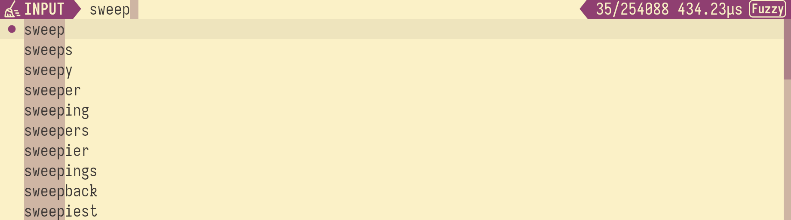
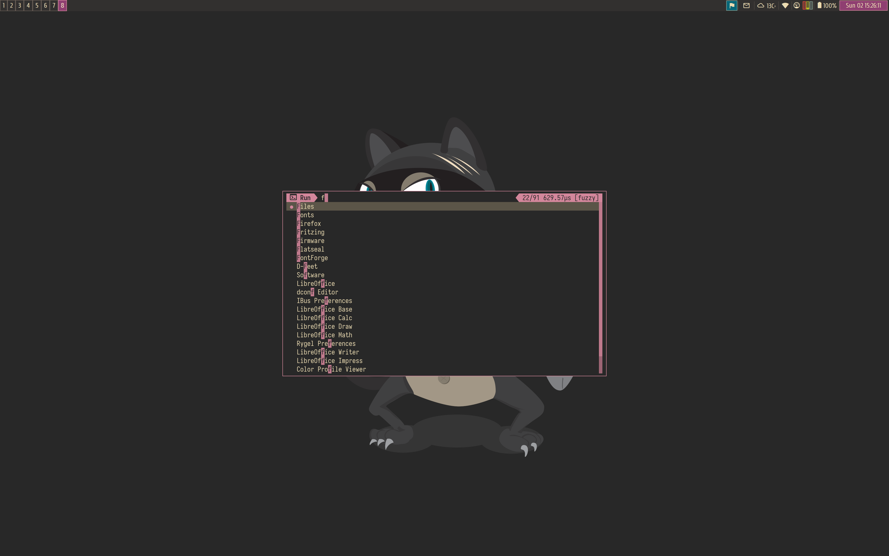

### Sweep
Sweep is a tool used to interactively search through a list of entries. It is inspired by [fzf](https://github.com/junegunn/fzf).


### Feautres
  - Fast
  - Beautiful
  - Easily custmizable color palette by specifiying only three main colors from which all other colors are drived.
  - JSON-RPC proctol can be used to communicate with sweep process.
  - Includes asyncio [pyton bingins](scripts/sweep.py)
  - Configurable key bindings

### Usage
#### Basic usage
```
Usage: sweep [--height <height>] [-p <prompt>] [--query <query>] [--theme <theme>] [--nth <nth>] [-d <delimiter>] [--keep-order] [--scorer <scorer>] [--debug] [--rpc] [--tty <tty>] [--no-match <no-match>] [--title <title>] [--altscreen] [--json] [--io-socket <io-socket>] [--version]

Sweep is a command line fuzzy finder

Options:
  --height          number of lines occupied by sweep
  -p, --prompt      prompt string
  --query           start sweep with the given query
  --theme           theme as a list of comma-separated attributes
  --nth             comma-separated list of fields for limiting search scope
  -d, --delimiter   filed delimiter
  --keep-order      keep order (don't use ranking score)
  --scorer          default scorer to rank candidates
  --debug           enable debugging output
  --rpc             use JSON-RPC protocol to communicate
  --tty             path to the TTY
  --no-match        action when there is no match and enter is pressed
  --title           set terminal title
  --altscreen       use alternative screen
  --json            expect candidates in JSON format
  --io-socket       path/descriptor of the unix socket used to communicate
                    instead of stdio/stdin
  --version         show sweep version and quit
  --help            display usage information
```
#### Key bindings
Current key bindings can be viewed by pressing `ctrc+h` and by default look like this:

| Name                 | Key Bindings      |
|----------------------|-------------------|
|sweep.scorer.next     | "ctrl+s"          |
|sweep.select          | "ctrl+j" "ctrl+m" |
|sweep.quit            | "ctrl+c" "esc"    |
|sweep.help            | "ctrl+h"          |
|input.move.forward    | "right"           |
|input.move.backward   | "left"            |
|input.move.end        | "ctrl+e"          |
|input.move.start      | "ctrl+a"          |
|input.move.next_word  | "alt+f"           |
|input.move.prev_word  | "alt+b"           |
|input.delete.backward | "backspace"       |
|input.delete.forward  | "delete"          |
|input.delete.end      | "ctrl+k"          |
|list.item.next        | "ctrl+n" "down"   |
|list.item.prev        | "ctrl+p" "up"     |
|input.page.next       | "pagedown"        |
|input.page.prev       | "pageup"          |

#### Bash history integration
Copy [`bash_history.py`](scripts/bash_history.py) [`path_history.py`](scripts/path_history.py) and [`sweep.py`](scripts/sweep.py) somewhere in your `$PATH`. Add this to your `~/.bashrc`
```bash
__sweep_platform=$(python3 -c 'import sys; print(sys.platform)')

# bash history lookup
__sweep_history__() {
    READLINE_LINE=$(bash_history.py --history-file=$HISTFILE --query "$READLINE_LINE")
    READLINE_MARK=0
    READLINE_POINT=${#READLINE_LINE}
}
bind -x '"\C-r": __sweep_history__'

# complete path
__sweep_path_complete__() {
    eval $(path_history.py select --readline)
}
bind -x '"\C-t": __sweep_path_complete__'

# open
__sweep_open__() {
    path=$(path_history.py select --query "$READLINE_LINE")
    if [ -d "$path" ];  then
        READLINE_LINE="cd $path"
    elif [ -f "$path" ]; then
        if [[ $(file --mime-type "$path" | awk '{ print $2 }') == text/* ]]; then
            READLINE_LINE="${EDITOR:-emacs} $path"
        else
            if [ $__sweep_platform = "linux" ]; then
                READLINE_LINE="xdg-open $path"
            elif [ $__sweep_platform = "darwin" ]; then
                READLINE_LINE="open $path"
            fi
        fi
    fi
    READLINE_MARK=0
    READLINE_POINT=${#READLINE_LINE}
}
bind -x '"\C-f": __sweep_open__'

__sweep_path_add__() {
    if [ ! "$__sweep_path_prev__" = "$(pwd)" ]; then
        __sweep_path_prev__="$(pwd)"
        path_history add
    fi
}
__sweep_path_prev__="$(pwd)"

PROMPT_COMMAND="__sweep_path_add__; $PROMPT_COMMAND"
```
This result in the following key binding in your bash session
* `ctrl+r` history lookup
* `ctrl+t` insert path (inspect key bindings with `ctrl+h`)
* `ctrl+o` open path (inspect key bindings with `ctrl+h`)


#### Sway run command integration
There is [sweep_kitty.py](scripts/sweep_kitty.py) which creates seprate kitty window. I use it to run commands in sway window manager. It requires [j4-dmenu-desktop](https://github.com/enkore/j4-dmenu-desktop) and [kitty](https://github.com/kovidgoyal/kitty) to be present.
```
set $run_menu j4-dmenu-desktop --display-binary --no-generic --term=kitty --dmenu='sweep-kitty --no-match=input --theme=dark --prompt="Run"' --wrapper "swaymsg -t command exec --"
for_window [app_id="kitty" title="sweep-menu"] {
    floating enable
    sticky enable
    resize set width 700 px height 400 px
}
$mod+d exec $run_menu
```
And here is how it looks


### Installation
  - Clone
  - Install rust toolchain either with the package manager of your choice or with [rustup](https://rustup.rs/)
  - Build and install it with cargo (default installation path is $HOME/.cargo/bin/sweep make sure it is in your $PATH)
  ```
  $ cargo install --path .
  ```
  - Or build it and copy the binary
  ```
  $ cargo build --release
  $ cp target/release/sweep ~/.bin
  ```
  - Test it
  ```
  $ printf "one\ntwo\nthree" | sweep
  ```
  - Enjoy

### Demo time!


### [JSON-RPC](https://www.jsonrpc.org/specification)
#### Wire protocol
```
<decimal string representing size of JSON object in bytes>\n
<JSON object>
```
#### Methods and Types
- **Type**
```
Field = String | (String, bool) | {text: String, active: bool}
Item = String | {entry: [Field], ...}
```
- **Methods**
```
items_extend(items: [Item])     // Extend list of searchable items
items_clear()                   // Clear list of searchable items
items_current() -> Item?        // Get currently selected item if any
query_set(query: String)        // Set query string used to filter items
query_get() -> String           // Get query string used to filter items
terminate()                     // Gracefully terminate sweep process
prompt_set(prompt: String)      // Set prompt string (lable string before search input)
bind(key: String, tag: String)  // Assign new key binding. `key` is a space separted list of chords, `tag` can either be sweep action, user action (bind notification is send) or empty string which means to unbind
```
- **Events** (encoded as method calls comming from the sweep process)
```
select(item: Item)  // Entry was selected by pressing `Enter` ("sweep.select" action)
bind(tag: String)   // Key binding was pressed, with previously registred key binding
```
