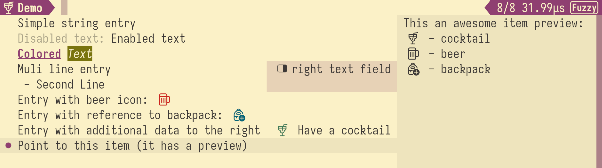

# Sweep

Sweep is a tool used to interactively search through a list of entries. It is inspired by [fzf](https://github.com/junegunn/fzf).


## Features

- Fast
- Beautiful
- Easily customizable color palette by specifying only three main colors from which all other colors are derived.
- JSON-RPC protocol can be used to communicate with sweep process.
- Includes asyncio [python binding](sweep/sweep/sweep.py)
- Configurable key bindings
- Support for rendering custom icons/glyphs from SVG path (requires kitty-image or sixel protocol support)

## Usage

### Basic usage

<details>
  <summary><code>$ sweep --help</code></summary>

```
Usage: sweep [--height <height>] [-p <prompt>] [--query <query>] [--theme <theme>] [--nth <nth>] [-d <delimiter>] [--keep-order] [--scorer <scorer>] [--rpc] [--tty <tty>] [--no-match <no-match>] [--title <title>] [--altscreen] [--json] [--io-socket <io-socket>] [--input <input>] [--version] [--log <log>] [--border <border>] [--preview <preview>]

Sweep is a command line fuzzy finder

Options:
  --height          number of lines occupied by sweep
  -p, --prompt      prompt string
  --query           initial query string
  --theme           theme as a list of comma-separated attributes
  --nth             comma-separated list of fields for limiting search scope
  -d, --delimiter   filed delimiter
  --keep-order      keep order of items, that is only filter and do not sort
  --scorer          default scorer to rank items
  --rpc             use JSON-RPC protocol to communicate
  --tty             path to the TTY
  --no-match        action when there is no match and enter is pressed
  --title           set terminal title
  --altscreen       use alternative screen
  --json            expect candidates in JSON format (uses the same item format
                    as RPC)
  --io-socket       path or file descriptor of the unix socket used to
                    communicate instead of stdio/stdin
  --input           read input from the file instead of stdin, ignored if
                    --io-socket is used
  --version         show sweep version and quit
  --log             enable logging into specified file path, logging verbosity
                    is configure with RUST_LOG
  --border          leave border on the sides
  --preview         whether to show item preview by default or not
  --help            display usage information
```

</details>

### Key bindings

Current key bindings can be viewed by pressing `ctrl+h`.

<details>
  <summary>Default key bindings</summary>

| Name                  | Key Bindings              | Description                                     |
| --------------------- | ------------------------- | ----------------------------------------------- |
| sweep.scorer.next     | `ctrl+s`                  | Switch to next available scorer                 |
| sweep.select          | `ctrl+j` `ctrl+m` `enter` | Return item pointed by cursor                   |
| sweep.quit            | `ctrl+c` `esc`            | Close sweep                                     |
| sweep.help            | `ctrl+h`                  | Show help                                       |
| sweep.preview.toggle  | `alt+p`                   | Toggle preview of an item                       |
| input.move.forward    | `right`                   | Move cursor forward in the input field          |
| input.move.backward   | `left`                    | Move cursor backward in the input field         |
| input.move.end        | `ctrl+e`                  | Move cursor to the end of the input field       |
| input.move.start      | `ctrl+a`                  | Move cursor to the beginning of the input field |
| input.move.next_word  | `alt+f`                   | Move cursor to the end of the current word      |
| input.move.prev_word  | `alt+b`                   | Move cursor to the start of the current word    |
| input.delete.backward | `backspace`               | Delete character to the left                    |
| input.delete.forward  | `delete`                  | Delete character to the right                   |
| input.delete.end      | `ctrl+k`                  | Delete everything to the right                  |
| list.item.next        | `ctrl+n` `down`           | Move to the next item in the list               |
| list.item.prev        | `ctrl+p` `up`             | Move to the previous item in the list           |
| list.page.next        | `pagedown`                | Move one page up                                |
| list.page.prev        | `pageup`                  | Move one page down                              |
| list.home             | `home`                    | Move to the beginning of the list               |
| list.end              | `end`                     | Move to the end of the list                     |

</details>

## Installation

- Clone this repository
- Install rust toolchain either with the package manager of your choice or with [rustup](https://rustup.rs/)
- Build and install it with cargo (default installation path is $HOME/.cargo/bin/sweep make sure it is in your $PATH)

  ```
  $ cargo install --path sweep
  ```

- Or build it and copy the binary

  ```
  $ cargo build --release --bin=sweep
  $ cp target/release/sweep ~/.bin
  ```

- Test it

  ```
  $ printf "one\ntwo\nthree" | sweep
  ```

- Enjoy

## Demo


You can also run [`python -msweep demo`](sweep/sweep/apps/demo.py) to see different formatting and icon usage. Note that to render icons terminal needs to support support kitty-image or sixel.


## JSON-RPC

Sweep support [JSON-RPC](https://www.jsonrpc.org/specification) communication protocol for easy integration python and other languages. It is enabled by `--rpc` flag, by default standard input and output is used for communication but if `--io-socket` is passed it can be either file descriptor or path to a socket on the filesystem.

### Wire protocol

Message is encoded as JSON per line

### Methods and Types

#### Types

##### Item

```
Item = String
| {
    target: [Field],
    right?: [Field],
    right_offset?: int = 0,
    right_face?: Face,
    preview?: [Field],
    preview_flex?: float = 0.0
    ...
}
```

`Item` is a searchable item, it can either be a string or a dictionary, if it is a string then it is equivalent to `{"target": string }`. This format of item is also used when `--json` flag is passed to sweep even without `--rpc`.

- `target` - Is a list of fields that is searchable shown on the left side
- `right` - Is a list of fields that is show on the right side
- `right_offset` - Is a number of columns that will be allocated for the right field. If it is not specified right field will take as much space as needed.
- `right_face` - Face used to fill right view
- `preview` - Additional information that will be shown when item is selected
- `preview_flex` - Determines how much space is allocated for preview, if it equal to 1.0 then it will take half of the available space. If i t is 0.0, then it will take as much space as needed.
- `...` - any additional fields are not parsed but are returned as a part of the result

##### Field

```
Field = String
| [String, bool]
| {
    text: String,
    active?: bool = True,
    glyph?: Icon,
    face?: Face,
    ref?: int
}
```

`Field` is used to construct `Item`, it can either be a string, list or a dictionary. String is equivalent to having just `text` field in the dictionary. List is equivalent to having `text` and `active` field in the dictionary.

- `text` - String content of the field
- `active` - Whether string is searchable or not
- `glyph` - Icon will be rendered in place of this field
- `face` - Face used to render this field
- `ref` - Reference to a field registered with `field_register`. If specified this field will inherit unspecified keys from registered field. It is useful when you want to avoid sending something like `Icon` multiple times.

##### Face

```
Face = "fg=#rrggbbaa,bg=#rrggbbaa,bold,italic,underline,blink,reverse,strike"
```

`Face` is text and glyph styling options, it is a comma separated string of text attributes.

- `fg` - foreground color (text color)
- `bg` - background color
- `bold` - bold text
- `italic` - italic text
- `underline` - show underline below text
- `blink` - blink text
- `reverse` - swap foreground and background

##### Icon

```
Icon = {
    path?: String,
    view_box?: [float; 4],
    fill_rule?: "nonzero" | "evenodd",
    size?: [int; 2],
}
```

`Icon` is an SVG path rendered as an icon, it is a dictionary with following attributes:

- `path` - Path specified in the same format as `d` attribute of [SVG `path`](https://www.w3.org/TR/SVG11/paths.html).
- `view_box` - [`minx`, `miny`, `width`, `height`] of the view port. If not specified bounding box with some padding is used.
- `fill_rule` - same as SVG fill-rule. "nonzero" is a default.
- `size` - [`rows`, `columns` ] how much space will be allocated for the icon.

#### Methods

| Method                                    | Description                                                                                                                                                                            |
| ----------------------------------------- | -------------------------------------------------------------------------------------------------------------------------------------------------------------------------------------- |
| `field_register(field: Field) -> int`     | Register field that can be used as the base for the other field                                                                                                                        |
| `items_extend(items: [Item])`             | Extend list of searchable items                                                                                                                                                        |
| `items_clear()`                           | Clear list of searchable items                                                                                                                                                         |
| `items_current() -> Item?`                | Get currently selected item if any                                                                                                                                                     |
| `query_set(query: String)`                | Set query string                                                                                                                                                                       |
| `query_get() -> String`                   | Get query string                                                                                                                                                                       |
| `terminate()`                             | Gracefully terminate sweep process                                                                                                                                                     |
| `prompt_set(prompt: String, icon?: Icon)` | Set prompt string (label string before search input)                                                                                                                                   |
| `bind(key: String, tag: String)`          | Assign new key binding. `key` is a space separated list of chords, `tag` can either be sweep a action, a user action (bind notification is send) or empty string which means to unbind |
| `preview_set(value?: bool)`               | Whether to show preview associated with the current item                                                                                                                               |

#### Events

Events are encoded as method calls coming from the sweep process without id
| Event | Description |
| - | -- |
| `select(item: Item)` | Entry was selected by pressing `Enter` ("sweep.select" action) |
| `bind(tag: String)` | Key binding was pressed, with previously registered key binding |
| `ready(version: [String])` | Sent on initialization of sweep peer |
