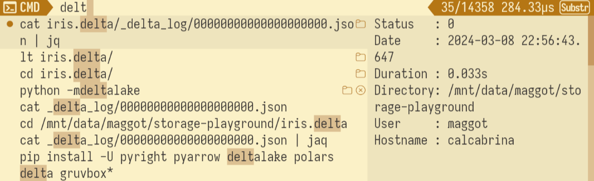
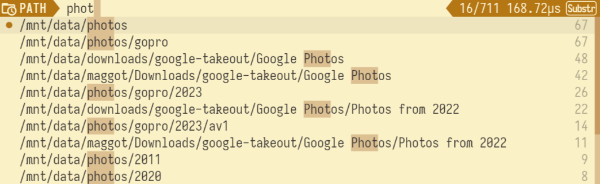
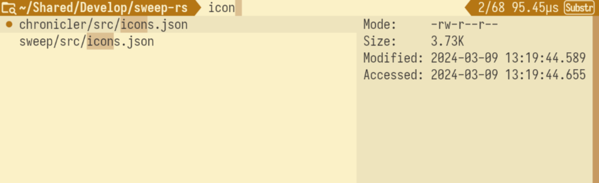

# Chronicler

Chronicler is a tool that is used to track history of commands executed in a shell, visited directories
and quick navigation and execution of commands from the history.

## Installation

- Build and install with `cargo install`
- Add this line to your `.bashrc`: `source <(chronicler setup bash)`

## Usage

Pressing `ctrl+r` in a bash shell opens commands history.

Pressing `ctrl+f` in a bash shell opens path history

While in path history pressing `tab` opens will start navigation in the selected directory

Theme can be set by exporting `SWEEP_THEME` environment variable to `accent=<color>,bg=<color>,fg=<color>` where color is `#RRGGBB`.
